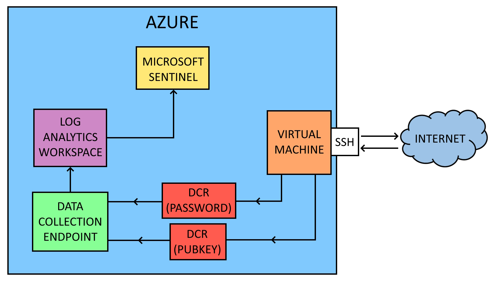

# Honeypot hosted in Azure and monitored with Microsoft Sentinel

## Introduction

In this project, I create a simple Microsoft Azure cloud environment to monitor information about attackers trying to log into an open SSH server from across the globe. This environment's main components are the virtual machine running as an SSH honeypot, the log analytics workspace for collecting and storing the honeypot logs from the virtual machine, and Microsoft Sentinel for visualising the log data.

## Requirements

For this project, you need to sign up to Microsoft Azure, Microsoft's cloud platform. Click [here](https://azure.microsoft.com/en-us) to sign up and follow along with this project.

## Design

Here is a diagram showing how the cloud environment has been setup.

The virtual machine hosts an SSH honeypot server that is open on the default SSH port (22) on the internet for anyone to connect to. This SSH server cannot be logged into, which prevents attackers from gaining access to the virtual machine. Every login attempt, both using password authentication and public key authentication is logged and stored in log files.

The data collection endpoint collects the log data from the virtual machine, using data collection rules to define what data it should collect.

The data collection endpoint forwards the logs to the log analytics workspace, which stores the logs and allows the Azure administrator to query the logs collected from the virtual machine and use them for other purposes.

Microsoft Sentinel is the Security Event and Information Management (SIEM) tool for Azure, and Sentinel will use the logs in the log analytics workspace to visualise the data in the form of a map to identify geolocation, and several tables that show trends such as the most common usernames and passwords used by attackers, or the most common type of public key encryption used.

## Sections

> NOTE - Files created in this project can be found in the directory of the section they have been created in

### [Setting up Azure Resources](./contents/azure_setup/)

Setting up the resources used for this project within Azure