# Setting up Azure Resources

### Table of Contents

[Setting up the virtual machine](#setting-up-the-virtual-machine)

[Sections](#sections)

## Setting up the virtual machine

Before setting up the virtual machine, you need to create a resource group to put all of the resources you will use in this project. Go to the search bar at the top and search 'Resource groups'. Then click on the first option that appears.

<p align="center">
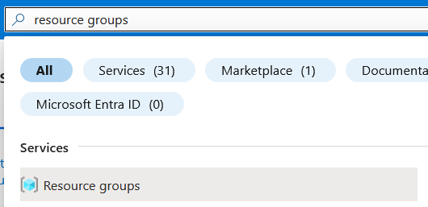
</p>

In the Resource groups page, click 'Create' to create a new resource group.

Make sure that you are using the correct subscription and give the resource group the name 'rg-honeypot' and change the region to the closest region to you.

<p align="center">
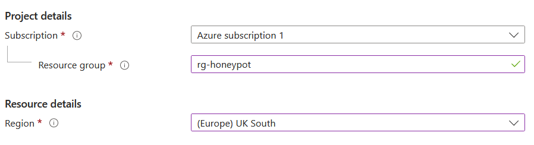
</p>

Then click 'Review + create', and once the details have been validated, click 'Create'.

After creating the resource group, the next resource to create is the virtual machine. In the search bar at the top, type 'Virtual machines' and select the Virtual machines option.

<p align="center">
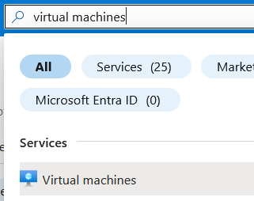
</p>

Then click 'Create > Azure virtual machine' to begin setting up the virtual machine.

Select the correct subscription and the same resource group created earlier (rg-honeypot). Then give the virtual machine the name 'vm-honeypot'. Make sure the region is the same region you selected for the resource group.

<p align="center">
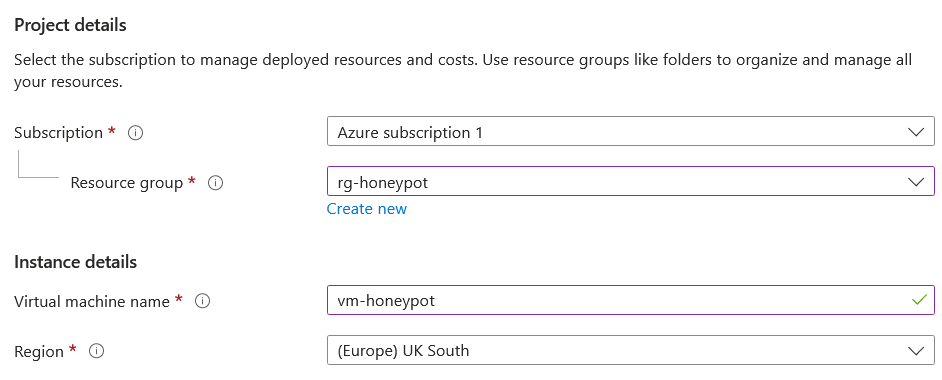
</p>

For this project, I recommend using Ubuntu Server 22.04, however any Linux distribution can work with this project.

Keep the architecture at 'x64' and change the size of the image to 'Standard_D2s_v3' with 2 VCPUs and 8 GiB of memory.

<p align="center">
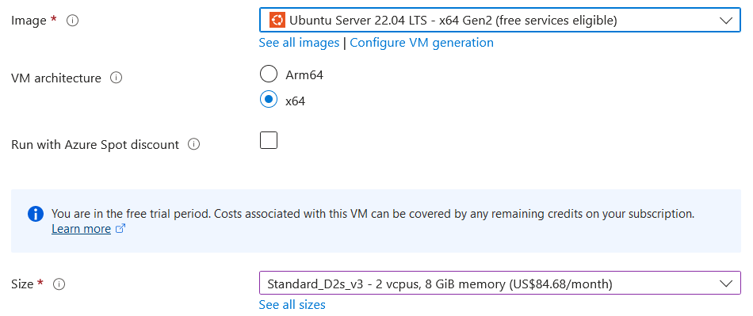
</p>

For the authentication type, I highly recommend using SSH public key authentication, to make your virtual machine more secure from attackers. Add a custom username to avoid using default configurations and then select 'Use existing public key' for the key source.

<p align="center">
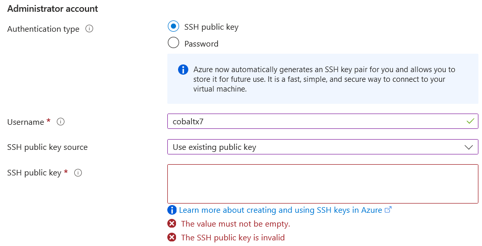
</p>

To generate the key, go to your terminal, and go to your .ssh folder:

```bash
# Windows (Powershell)
cd ~\.ssh
# Linux
cd ~/.ssh
```

Then generate a key pair with ```ssh-keygen```:

```bash
ssh-keygen -f <key_name>
```

Enter a passphrase for the key, confirm it by retyping it and then the key will be created.

<p align="center">
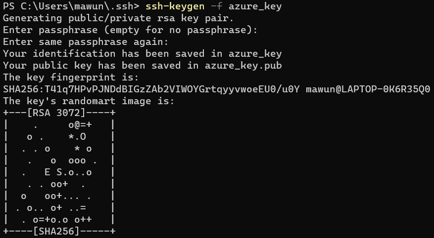
</p>

Then output the contents of the public key, and copy and paste the text into the 'SSH public key' field in Azure.

<p align="center">
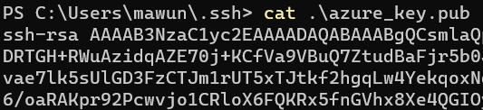
</p>

<p align="center">
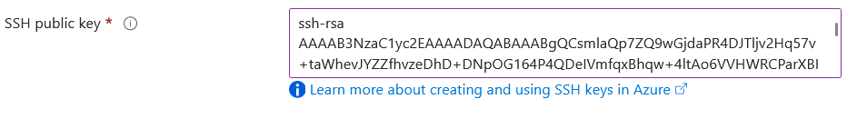
</p>

Click 'Next > Next' to go to the networking settings. Then click the Advanced radio button for the 'NIC network security group' option, and click 'Create new' under the 'Configure network security group' option.

<p align="center">
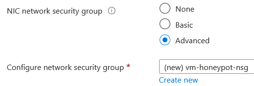
</p>

Delete the current inbound rule and add a new inbound rule. Change the 'Destination port ranges' to '*' for all ports, change the priority to 100, and give the security rule the name 'ALLOW-ALL-INBOUND'.

<p align="center">
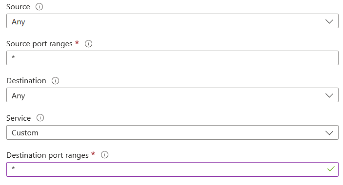
</p>

<p align="center">
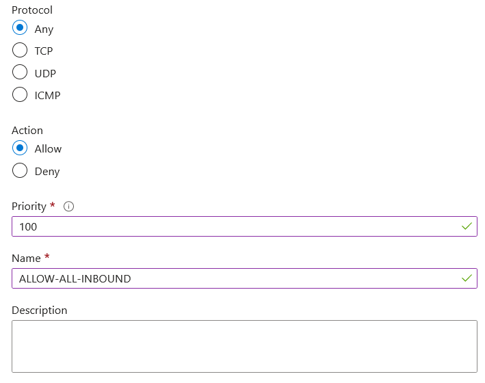
</p>

Then click 'Add', then 'OK'. Then click 'Review + create'. Once the validation has passed for the virtual machine, click 'Create' to create the virtual machine.

The VM will begin its deployment, and once it is done you will be able to SSH into it from your terminal.

## Setting up the Log Analytics workspace

After setting up the virtual machine, the next resource to setup is the log analytics workspace, which will collect the logs from the virtual machine.

Go to the search bar and search 'Log Analytics workspaces' and select the 'Log Analytics workspaces' option.

<p align="center">
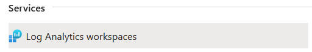
</p>

In the Log Analytics workspaces page, click 'Create' to create a new LAW (log analytics workspace). Make sure you're using the correct subscription, and select the 'rg-honeypot' resource group. Name the workspace 'law-honeypot' and make sure the region matches the region you have used for the other resources thus far.

<p align="center">
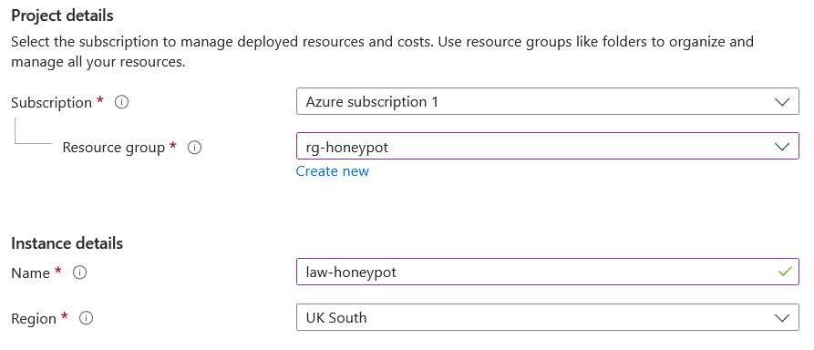
</p>

Then click 'Review + Create'. Once the validation check has passed, then click 'Create'. Then the LAW will begin deployment.

After the LAW has been created, search 'Defender' in the search bar at the top of the page and select 'Microsoft Defender for Cloud'.

<p align="center">
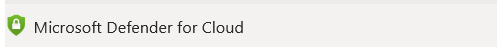
</p>

Then go to the 'Environment settings' tab, and select the LAW.

<p align="center">
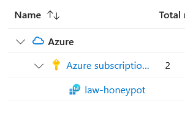
</p>

In the 'Defender plans' tab, turn on the 'Servers' plan and click 'Save' to save the changes.

<p align="center">
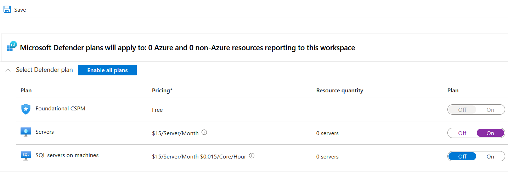
</p>

In the 'Data collection' tab, select 'All Events' and click 'Save' to save the changes.

<p align="center">
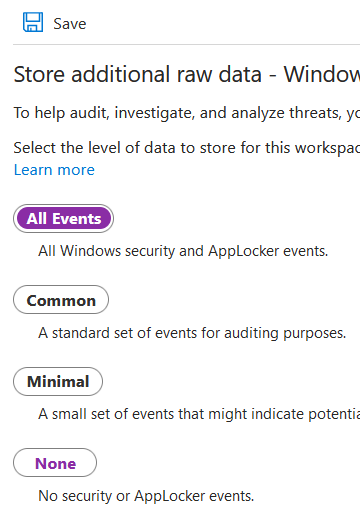
</p>

## Sections

#### Home Page: [Azure Sentinel Honeypot](../../)

#### Next Section: [...](...)
