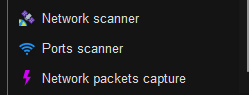

# Setting up the Honeypot

### Table of Contents

[Initial Virtual Machine Setup](#initial-virtual-machine-setup)

[Honeypot Container Setup](#honeypot-container-setup)

[Sections](#sections)

## Initial Virtual Machine Setup

Now that the virtual machine, the log analytics workspace, and the Microsoft Sentinel instance are setup up, the next step is setting up the virtual machine from the inside. There are three things that need to be done: changing the real SSH port, installing Docker to run the honeypot, and configuring iptables to hide the real SSH server from port scanning.

Firstly, go to Azure and in the top search bar, search 'virtual machine' and select the 'Virtual machines' option. Then select 'vm-honeypot' and copy the virtual machine's public IP address.

<p align="center">

</p>

Then go to either your terminal or an SSH client such as PuTTY or Mobaxterm, and then connect to port 22 of your VM via SSH using the username you entered during the creation of the VM, and the private key you created in the terminal.

```bash
ssh -i <private_key> <username>@<ip_address>
```

In the terminal, download the .env file and the shell script from this GitHub repository:

```bash
wget https://raw.githubusercontent.com/ManuelDogbatse/azure_sentinel_honeypot/main/contents/honeypot_setup/files/ports.env ; wget https://raw.githubusercontent.com/ManuelDogbatse/azure_sentinel_honeypot/main/contents/honeypot_setup/files/setup_honeypot_server.sh
```

Then edit the ports.env file using nano or vim and change the SSH port to a different port than 22. Then change the knock ports to random numbers between 1024 and 65535. You can use an online random number generator to generate these values. Make a note of all of the ports that you have selected on your personal computer, so that you can sign in again into your virtual machine.

<p align="center">

</p>

After that, give the shell script executable privileges and run the script as sudo:

```bash
chmod 755 setup_honeypot_server.sh
sudo ./setup_honeypot_server.sh
```

When you get a prompt like the image below, select '\<Yes\>' and press Enter.

<p align="center">

</p>

Now that the server has been setup, exit the terminal to refresh your user's account privileges.

Now that port knocking has been enabled, you must first scan each knock port in order within a 10 second time frame between each scan to be able to connect to the SSH server. To port knock, you can use any application or binary to make a TCP connection to each port, such as telnet, nmap or FTP.

For example, in Mobaxterm, port knocking is done by using the 'Ports scanner' tool in the 'Tools' tab.

<p align="center">


</p>

Firstly, edit the session and change the SSH port to the new port you chose in the .env file. Then open 'Ports scanner' and enter the public IP address of the virtual machine, select 'Scan ports range' and copy and paste the first port in the knock sequence defined in the .env file. Pasting is done using 'SHIFT + INSERT'.

<p align="center">

</p>

Then press 'Start scan' and stop it after one second. Replace the ports range to the next port in the knock sequence and start the scan again for one second. This must be done within 10 seconds or the knock sequence will fail. Repeat this until you have scanned the last port in the knock sequence.

After completing the knock sequence, you will now be able to log into the virtual machine via SSH.

## Honeypot Container Setup

## Sections

#### Home Page: [Azure Sentinel Honeypot](../../)

#### Previous Section: [Setting up Azure Resources](../azure_setup/)

#### Next Section: [...](...)
