# Collecting logs from Virtual Machine

### Table of Contents

[Creating custom logs](#creating-custom-logs)

[Creating the Data Collection Endpoint](#creating-the-data-collection-endpoint)

[Creating the Data Collection Rules](#creating-the-data-collection-rules)

[Sections](#sections)

## Creating custom logs

Before collecting the honeypot logs from the virtual machine, you need to create custom logs for each authentication attempt. To do this, go to Azure and go to the 'Log analytics workspaces' page.
Then select 'law-honeypot' and click the 'Tables' tab, underneath 'Settings'. Click 'Create > New custom log (MMA-based)' to begin creating the custom logs.

There are two custom logs that need to be made: one for password authentication attempts, and the other for public key authentication attempts.

Click the links to the sample logs from this repository and click the download button to save them in your local storage: [Sample Password Authentication Logs](https://github.com/ManuelDogbatse/azure_sentinel_honeypot/blob/main/contents/log_collection/files/ssh_password_logins.log), [Sample Public Key Authentication Logs](https://github.com/ManuelDogbatse/azure_sentinel_honeypot/blob/main/contents/log_collection/files/ssh_public_key_logins.log)

<p align="center">
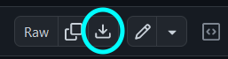
</p>

Then in Azure, upload the password log file as the sample log.

<p align="center">
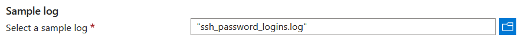
</p>

Then click 'Next' and make sure 'New line' is selected as the delimiter. Click 'Next' to enter the log path. For the collection path, choose 'Linux' for the path type and enter absolute path of the ```logs``` folder in the ```ssh_honeypot``` repository clone in your virtual machine, followed by ```/ssh_password_logins.log``` for the path:

<p align="center">
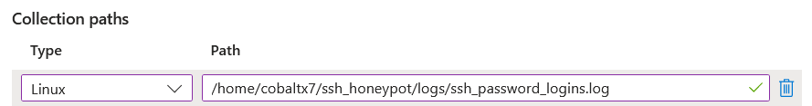
</p>

Click 'Next' and give the custom log the name 'SSH_PASSWORD_LOGS'. Azure will automatically append '_CL' to the custom log name, making the final name 'SSH_PASSWORD_LOGS_CL'.

<p align="center">
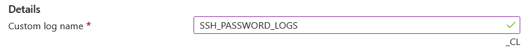
</p>

Click 'Next' and then 'Create' to create the custom log for password authentication.

Repeat this step again, but this time:

- Upload the sample public key logs

- Enter the same path, but change the file name to ```ssh_public_key_logins.log```

- Give the custom log the name 'SSH_PUBKEY_LOGS'

You should now have two custom logs: ```SSH_PASSWORD_LOGS_CL``` and ```SSH_PUBKEY_LOGS_CL```.

<p align="center">
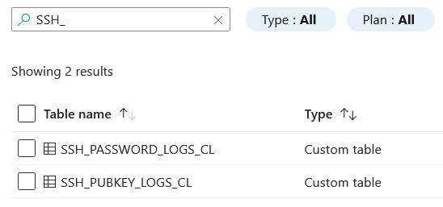
</p>

## Creating the Data Collection Endpoint

To gather the logs from the virtual machine, you need to create a data collection endpoint, which will collect logs directly from the machine and forward them to the log analytics workspace.

In Azure, search 'monitor' and select the 'Monitor' option:

<p align="center">
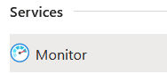
</p>

Then go to the 'Data Collection Endpoints' tab under 'Settings', and click 'Create'. Give the endpoint the name 'dce-honeypot', choose the 'rg-honeypot' resource group, and change the region to the region you have been using thus far.

<p align="center">
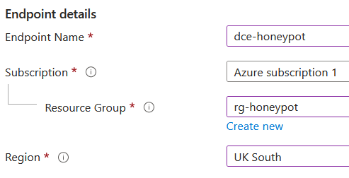
</p>

Click 'Review + create' and 'Create' once the validation has passed.

## Creating the Data Collection Rules

In the 'Monitor' page, go to the 'Data Collection Rules' tab under 'Settings' and click 'Create'.

Set the rule name to 'dcr-password-honeypot', set the resource group to 'rg-honeypot', set the region to your region, set the platform type to 'Linux' and select the 'dce-honeypot' DCE you previously created.

<p align="center">
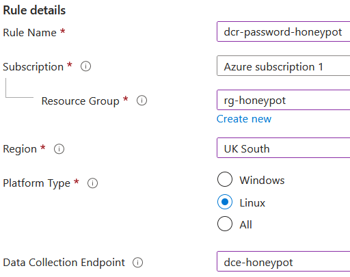
</p>

Click 'Next' and check the 'Enable Data Collection Endpoints' checkmark. Then click 'Add resources', select the 'vm-honeypot' virtual machine and click 'Apply'. Then for the 'Data collection endpoint' option, select 'dce-honeypot' and click 'Next'.

<p align="center">
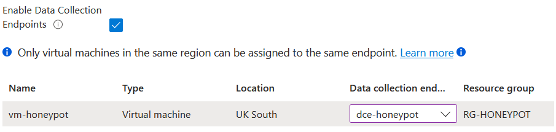
</p>


Click 'Add data source' and select 'Custom Text Logs' as the data source type. Then enter the same path you used to create the custom log for the custom password logs as the file pattern. Enter the name of the custom password log (```SSH_PASSWORD_LOGS_CL```) and click 'Next'.

<p align="center">
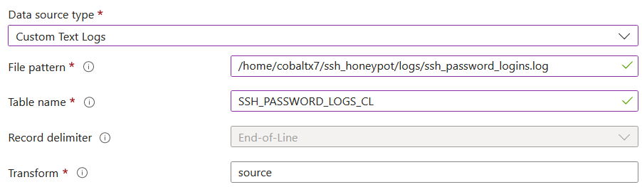
</p>

Select 'Azure Monitor Logs' as the destination type, choose your subscription and 
select the 'law-honeypot' LAW and click 'Add data source'.

<p align="center">
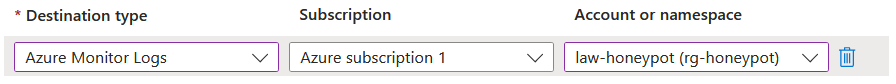
</p>

Click 'Review + create' and click 'Create' once the validation has passed.

Repeat the steps for creating a data collection rule, but this time for the public key logs. Name the rule 'dcr-pubkey-honeypot':

<p align="center">
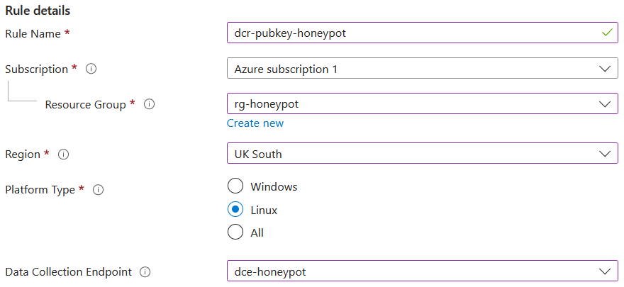
</p>

In the data source options, set the file pattern to the public key log file, and set the table name to ```SSH_PUBKEY_LOGS_CL```

<p align="center">
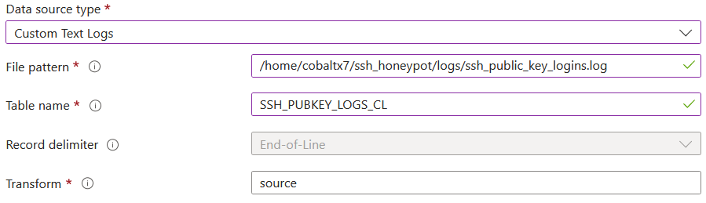
</p>

Now the logs will be collected and stored in the log analytics workspace. It will take about 10 minutes for the logs to show up in queries.

To see the logs from the honeypot, go to the 'Log Analytics workspaces' page, select 'law-honeypot' and go to the 'Logs' tab.

Close the modal, enter either 'SSH_PASSWORD_LOGS_CL' or 'SSH_PUBKEY_LOGS_CL' in the query text field, and click 'Run'. The results will show all the logs created by the honeypot after the data collection endpoint and rules were made.

<p align="center">
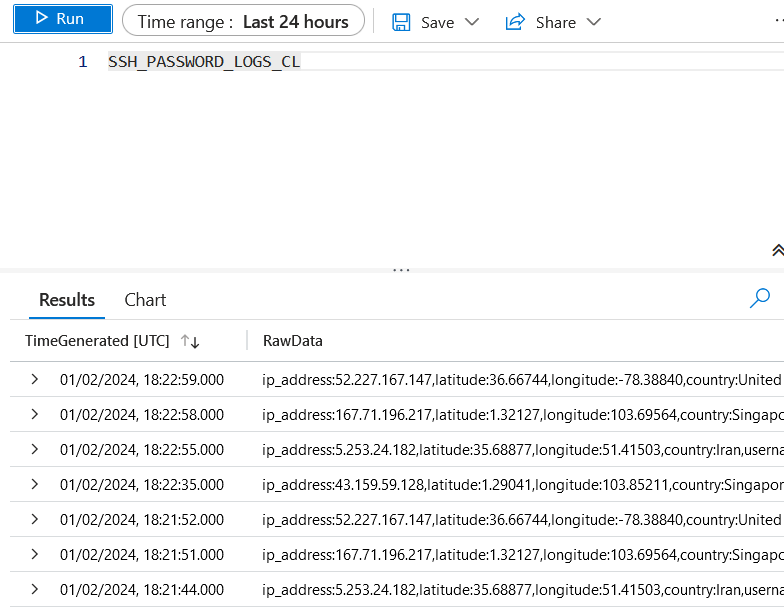
</p>

## Sections

#### Home Page: [Azure Sentinel Honeypot](../../)

#### Previous Section: [Setting up the Honeypot](../honeypot_setup/)

#### Next Section: [Monitoring logs with Microsoft Sentinel](../sentinel/)