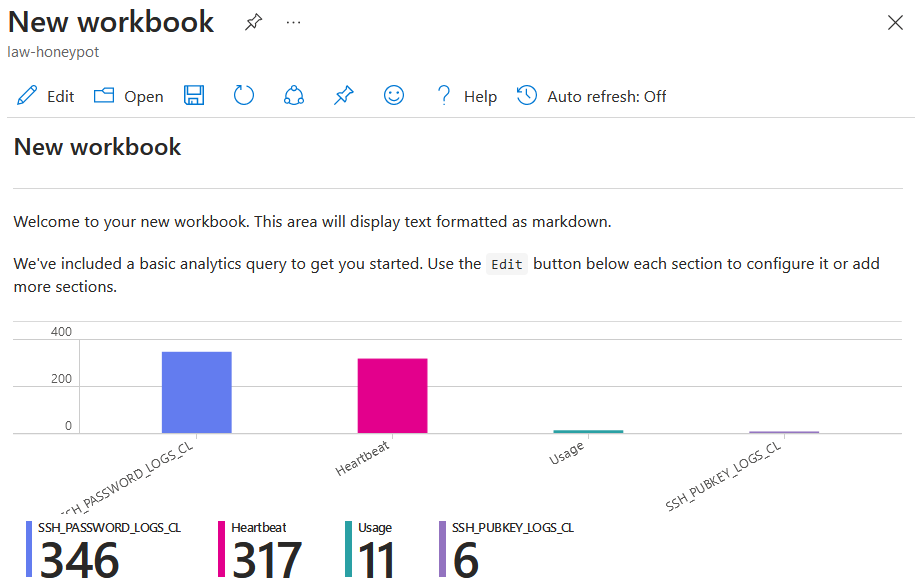

# Monitoring logs with Microsoft Sentinel

### Table of Contents

[Creating a workbook in Sentinel](#creating-a-workbook-in-sentinel)

[Sections](#sections)

## Creating a workbook in Sentinel

Now that the logs have been collected from the virtual machine, the next step is to visualise the log data in a presentable and meaningful way.

In Azure, go to the 'Microsoft Sentinel' page. Then click the 'law-honeypot' Sentinel instance created in earlier steps. Then go to the 'Workbooks' tab under 'Threat management' and click 'Add Workbook'.

## Sections

#### Home Page: [Azure Sentinel Honeypot](../../)

#### Previous Section: [Collecting logs from Virtual Machine](../log_collection/)