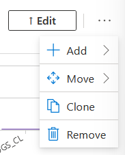
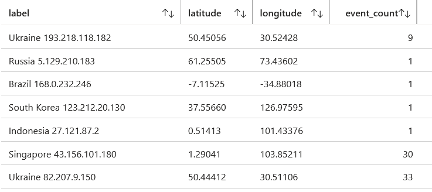
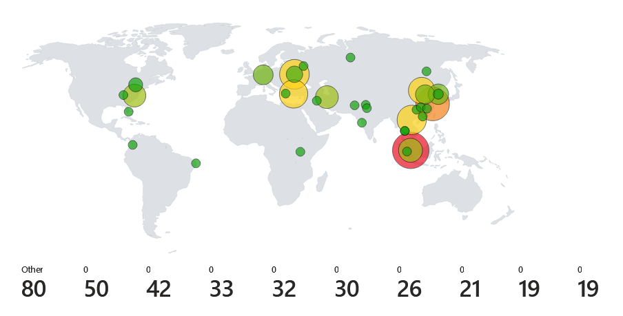
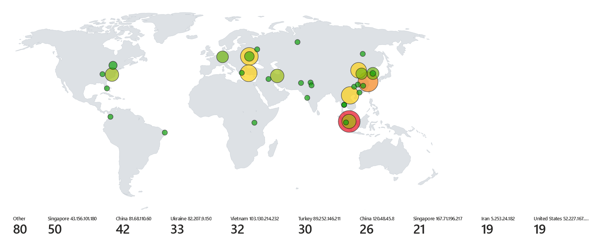
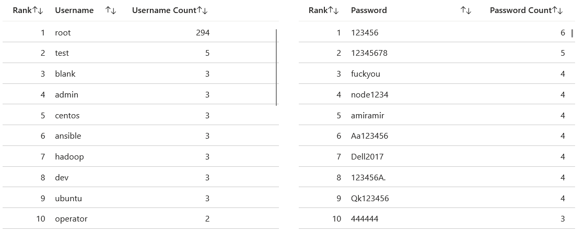

# Monitoring logs with Microsoft Sentinel

### Table of Contents

[Creating a workbook in Sentinel](#creating-a-workbook-in-sentinel)

[Sections](#sections)

## Creating a workbook in Sentinel

Now that the logs have been collected from the virtual machine, the next step is to visualise the log data in a presentable and meaningful way.

In Azure, go to the 'Microsoft Sentinel' page. Then click the 'law-honeypot' Sentinel instance created in earlier steps. Then go to the 'Workbooks' tab under 'Threat management' and click 'Add Workbook'.

<p align="center">

</p>

For this lab, I made a map that visualises the location of all the attacks and their frequency by region on a map.

To do this, firstly click 'Edit' and remove the template items by clicking the ellipsis icon under each item and clicking 'Remove > Yes'.

<p align="center">

</p>

Then click 'Add > Add query'. In Azure, queries are made to logs using the Kusto Query Language (KQL). Once the query item appears, copy and paste the following KQL query into the query text field:

```kql
SSH_PASSWORD_LOGS_CL | union SSH_PUBKEY_LOGS_CL
| extend ip_address = extract(@"ip_address:([^,]+)", 1, RawData)
| extend latitude = extract(@"latitude:([^,]+)", 1, RawData)
| extend longitude = extract(@"longitude:([^,]+)", 1, RawData)
| extend country = extract(@"country:([^,]+)", 1, RawData)
| extend label = strcat_delim(" ", country, ip_address)
| where (country != "null" and country != "" and isnotnull(country))
| summarize event_count=count() by label, latitude, longitude
```

This query get both the password and public key authentication attempt logs and extracts the values for the necessary columns for the map. It also counts the number of login attempts from a specific IP address to show on the map.

After running the query, you should see a table like this:

<p align="center">

</p>

Set the 'Visualisation' option to 'Map' and the table will change to a map.

<p align="center">

</p>

Some modifications need to be made so that the right information appears. Exit 'Map Settings' if already opened, and set the size to 'Large' to get a larger view of the map. Then click 'Map Settings' and make sure the location info is using 'Latitude/Longitude', with both the latitude and longitude options using the latitude and longitude columns of the KQL query table. Size the map by 'event_count' and change the minimum and maximum region size to suitable values for your map. Under 'Metric Settings', change the metric label to 'label', and then click 'Apply' to update the map with the new changes.

Your map should appear like the following image, minus the differences in logs:

<p align="center">

</p>

The map now shows all the locations for the login attempts and the frequency of each one. From this map, we can tell that an attacker from Singapore with the IP address of 43.156.101.180 has made the most login attempts to the server, with a total of 50 attempts. The location of the attacker is shown as the red circle on the map.

Two useful visualisations we can create from the logs are tables for showing the most used usernames and passwords. To do this, create another query item like the previous query item, but this time use the following two KQL statements, and set the visualisation to a grid.


For the most used usernames:
```kql
SSH_PASSWORD_LOGS_CL
| extend country = extract(@"country:([^,]+)", 1, RawData)
| extend Username = base64_decode_tostring(tostring(extract(@"username:([^,]+)", 1, RawData)))
| where (country != "null" and country != "" and isnotnull(country))
| summarize ["Username Count"] = count() by Username
| order by ["Username Count"]
| extend Rank = row_number()
| project Rank, Username, ["Username Count"]
```

For the most used passwords:
```kql
SSH_PASSWORD_LOGS_CL
| extend country = extract(@"country:([^,]+)", 1, RawData)
| extend Password = base64_decode_tostring(tostring(extract(@"password:([^,]+)", 1, RawData)))
| where (country != "null" and country != "" and isnotnull(country))
| summarize ["Password Count"] = count() by Password
| order by ["Password Count"]
| extend Rank = row_number()
| project Rank, Password, ["Password Count"]
```

<p align="center">

</p>

Based off the grids, the most common username used is 'root' by an enormous amount, and the most common password used is '123456'.

With this information, it shows that attackers are trying to gain root access to the virtual machine and are using common passwords to attempt logging in. As a server administrator hosting an SSH server on the internet, this tells us that we should implement security controls such as disabling root login from SSH, using complex passwords for users in the system, and avoiding password authentication entirely and relying on public key authentication.

## Sections

#### Home Page: [Azure Sentinel Honeypot](../../)

#### Previous Section: [Collecting logs from Virtual Machine](../log_collection/)